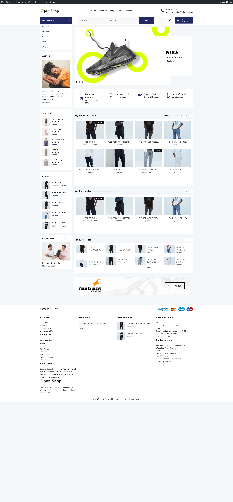
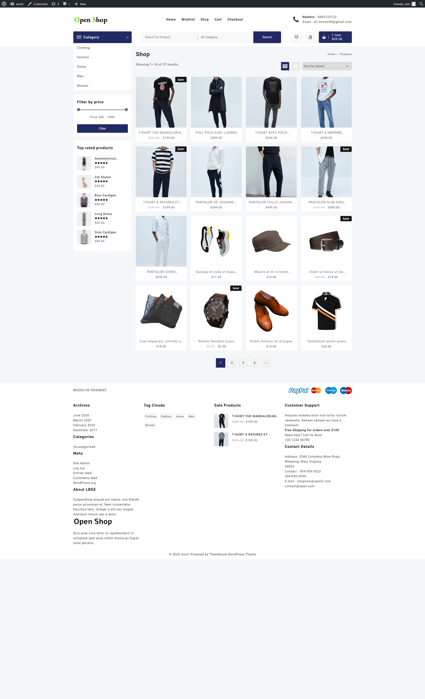
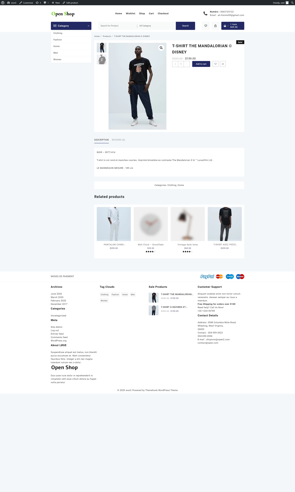
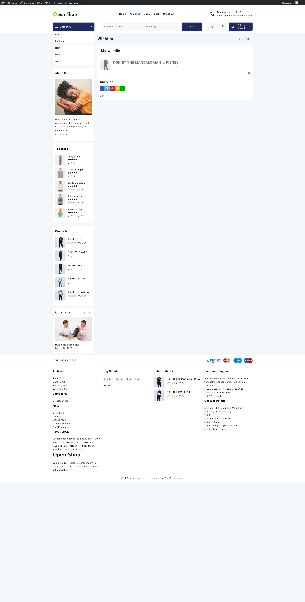
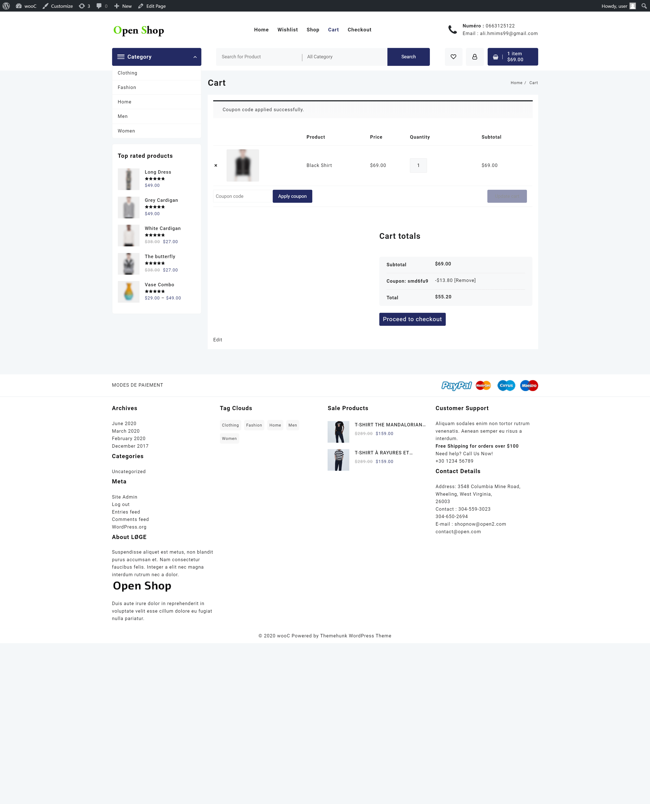
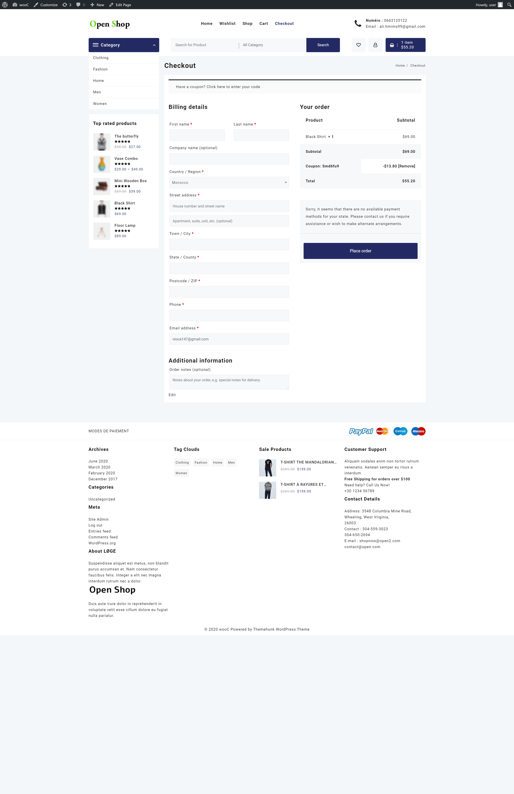
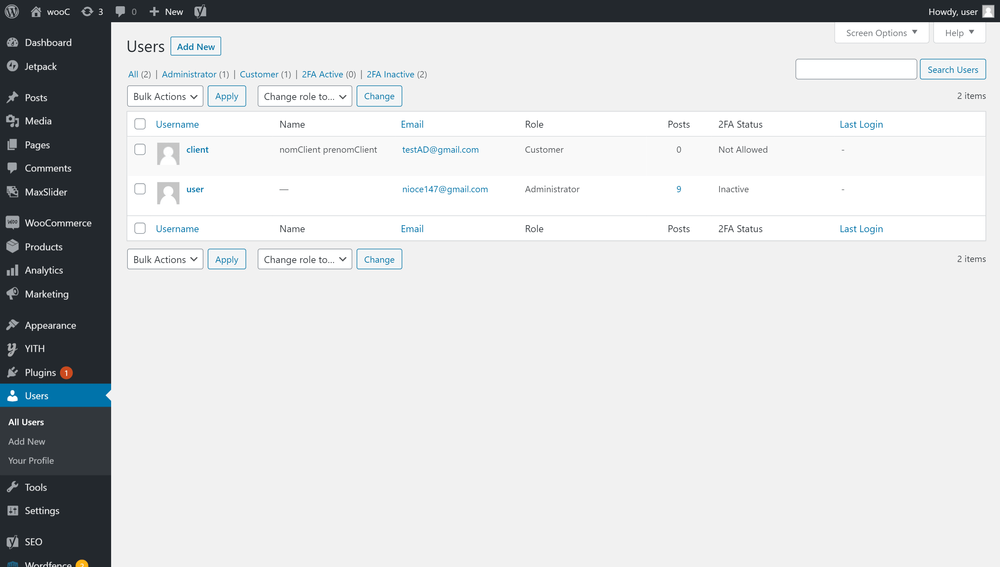

# Brief 12

## Installation

1. Installation de Wordpress : https://wordpress.org/download/
2. Installation de plugin WooCommerce : https://wordpress.org/plugins/woocommerce/
3. Installation de theme OpenShop : https://wordpress.org/themes/open-shop/
4. Installation de plugin Yoast SEO : https://fr.wordpress.org/plugins/wordpress-seo/
5. Installation de plugin Wordfence Security : https://fr.wordpress.org/plugins/wordfence/
6. Installation de plugin de multilangue Weglot : https://wordpress.org/plugins/weglot/

## Captures d'écran

### Page d'accueil

  

### Page produits

  

### Page d'un produit

  

### Page wishlist

  

### Page panier

  

### Page checkout

  

### Liste d'utilisateurs 

  

